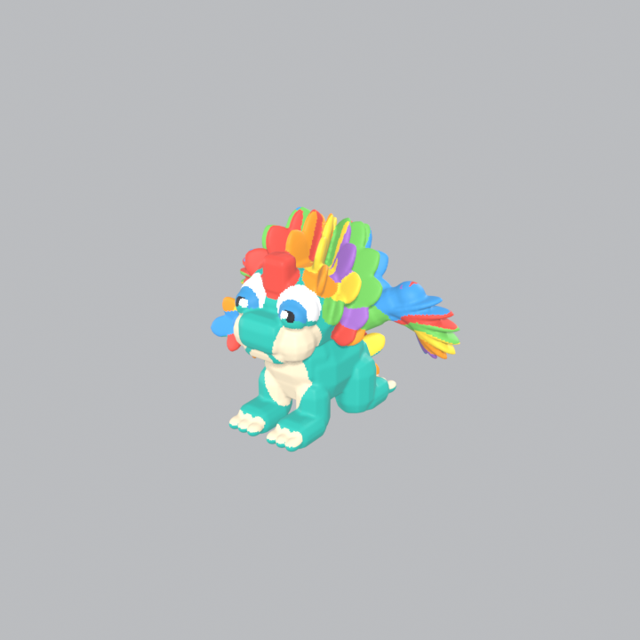

# Quetzalog Mascot — 3D Printable Reconstruction

A **watertight, manifold, 3D-printable** reconstruction of the Quetzalog
mascot, generated procedurally in Blender from six orthographic reference
views.



## Overview

The mascot (a chibi teal dragon with a rainbow feather crest, feathered wings,
a curled feathered tail, big cartoon eyes and cream muzzle/belly) was rebuilt
as a single coherent 3D volume — not a flat extrusion or a set of per-view
planes. All geometry is generated by deterministic Blender Python and unioned
with a voxel remesh into one watertight solid.

- **Dimensions:** 134.07 × 95.16 × 100.00 mm (W × D × H)
- **Topology:** 123,286 verts · 122,989 faces · 1 connected component
- **Validation:** 0 non-manifold edges · 0 boundary edges · 0 loose geometry · 0 degenerate faces
- **Print:** flat stable base, min feature thickness ≈ 1.37 mm

Full model report: [`output/README.md`](output/README.md)

## Repository layout

```
views/                  six orthographic reference images (front/back/left/right/top/bottom)
scripts/
  build_quetzalog.py    procedural blockout -> details -> remesh -> materials -> scale
  finalize_export.py    print-ready collection, validation, STL/3MF export, blend save
  render_views.py       renders the six views + a perspective preview
  analyze_views*.py     reference image inspection helpers
  profile.py            reference silhouette profiling
output/
  quetzalog_mascot_print_ready.blend   full Blender project (references, model, cameras, lights)
  quetzalog_mascot_print_ready.stl     binary STL, millimetres
  quetzalog_mascot_print_ready.3mf     3MF with per-face colours
  validation_report.txt                mesh audit
  README.md                            model documentation
  renders/                             front/back/left/right/top/bottom/persp PNGs
```

## Reproducing

Requires Blender (tested on 5.2 LTS). Run the scripts inside Blender in order:

```python
exec(compile(open("scripts/build_quetzalog.py").read(), "build_quetzalog.py", "exec"))
exec(compile(open("scripts/render_views.py").read(), "render_views.py", "exec"))
exec(compile(open("scripts/finalize_export.py").read(), "finalize_export.py", "exec"))
```

## Printing

Print **upright as modelled** — the flat base (four feet) on the build plate,
`+Z` up. Resin (SLA/DLP) recommended for finest detail; FDM works with a
0.4 mm nozzle and supports under the wing, crest and tail overhangs.

## License

[MIT](LICENSE) © 2026 Mauro Parra
