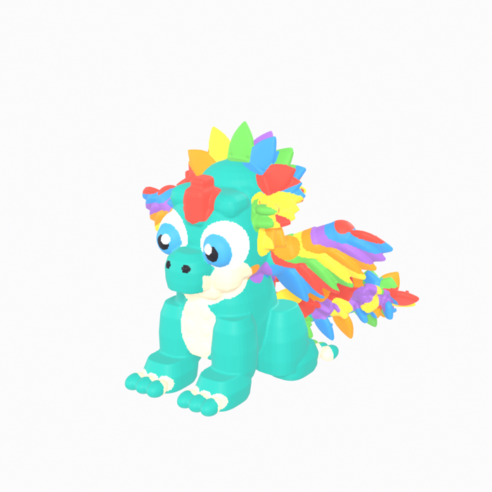

# Quetzalog Mascot — 3D Printable Reconstruction

A **watertight, manifold, 3D-printable** reconstruction of the Quetzalog
mascot, inferred as a real three-dimensional form from six orthographic
reference views.



## Overview

The mascot — a chibi teal dragon with a rainbow feather crest, feathered
wings, a curled feathered tail, big cartoon eyes and a cream muzzle/belly — is
rebuilt from **measured cross-sections** taken off the reference images, not by
extruding or displacing those images.

- **Dimensions:** 120.23 × 104.19 × 100.00 mm (W × D × H)
- **Topology:** 250,654 verts · 250,337 faces · 1 connected component
- **Validation:** 0 non-manifold · 0 boundary · 0 loose · 0 degenerate faces
- **Print:** flat stable base (1133 mm²), median thickness 12.5 mm, min 2.8 mm (5th pct)

Full model report, methodology and known deviations: [`output/README.md`](output/README.md)

## Reconstruction approach

| stage | technique |
|---|---|
| analysis | references composited on white, colour-segmented, gridded and profiled row-by-row |
| body / head / snout / neck / limbs | super-elliptical cross-section **lofts** from measured sections |
| tail | Catmull-Rom spline core + tapering tube with radial feather rings |
| wings | measured arm chain + fan of flat feather plates |
| crest | 5-ring layered **petal rosette**, petals coplanar with their ring |
| feathers | reusable flat leaf blade with a LEGO stud |
| eyes | layered sclera / iris / pupil / highlight spheres |
| unification | join + 0.45 mm voxel remesh → single watertight shell |
| materials | 11 colours assigned per face from a procedural region registry |

Measurement data and proportions: [`scripts/SPEC.md`](scripts/SPEC.md)

## Repository layout

```
views/                    six orthographic reference images
scripts/
  SPEC.md                 measured reconstruction specification
  analyze_regions.py      colour segmentation + row profiling of the references
  grid_refs.py            coordinate-grid overlays for manual measurement
  profile_compare.py      per-row silhouette delta (reference vs model)
  build_v4.py             final procedural build (v2/v3 kept for the iteration history)
  render_compare.py       reference-matched orthographic renders + overlays
  make_comparison.py      builds the six comparison sheets
  render_persp.py         perspective coherence renders
  finalize_export.py      validation, STL/3MF export, .blend save
output/
  quetzalog_mascot_print_ready.blend
  quetzalog_mascot_print_ready.stl      binary STL, millimetres
  quetzalog_mascot_print_ready.3mf      3MF with per-face colours
  validation_report.txt
  hero.png
  comparison/                           REFERENCE | MODEL | OVERLAY sheets
  renders/
```

## Reproducing

Requires Blender (tested on 5.2 LTS). Run inside Blender in order:

```python
exec(compile(open("scripts/build_v4.py").read(),     "build_v4.py", "exec"))
exec(compile(open("scripts/render_compare.py").read(),"render_compare.py", "exec"))
exec(compile(open("scripts/render_persp.py").read(),  "render_persp.py", "exec"))
exec(compile(open("scripts/finalize_export.py").read(),"finalize_export.py", "exec"))
```

## Printing

Print **upright as modelled** — the flat base (four feet) on the build plate,
`+Z` up. Resin (SLA/DLP) recommended for the finest feather detail; FDM works
with a 0.4 mm nozzle and supports under the wing, crest and tail overhangs.

## License

[MIT](LICENSE) © 2026 Mauro Parra
